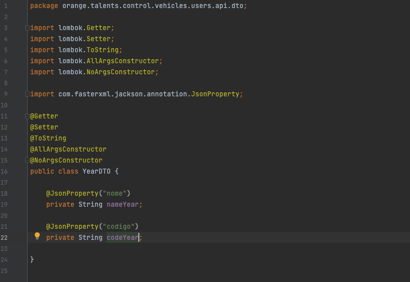

# Desafio Zup -> Orange Talents -> 2021

Projeto Orange Talents 2021 - API Rest para controlar o cadastro de veículos de usuários.

- [Desafio Zup -> Orange Talents -> 2021](#desafio-zup-orange-talents-2021)
  + [Sobre o Desafio (Projeto)](#sobre-o-desafio-(projeto))
  + [Motivação para as tecnologias presentes no projeto](#motivação-para-as-tecnologias-presentes-no-projeto)
  + [Estrutura e inicialização do Projeto](#estrutura-e-inicialização-do-projeto)
  + [Testes](#testes)
  + [Implementação do sistema na Web](#implementação-do-sistema-na-web)
  + [Considerações Finais](#considerações-finais)
  + [Executando Projeto](#executando-projeto)
  + [Código Completo](#código-completo)


## Sobre o Desafio (Projeto)

<ul>
  <li>Efetuar a criação de uma API Rest que irá controlar veículos de usuários.</li>
  <ul>
    <li>Primeiro passo: Efetuar a criação de um cadastro de usúarios, onde, os seguintes dados serão obrigatórios: nome, e-mail, CPF e data de nascimento, sendo que e-mail e CPF devem ser únicos.</li>
    <li>Segundo passo: Efetuar a criação de um cadastro de veículos, onde, os seguintes dados serão obrigatórios: Marca, Modelo do Veículo e Ano. O Serviço em si deve consumir a API da FIPE(https://deividfortuna.github.io/fipe/) para obter os dados do veículo baseado nas informações inseridas.</li>
    <li>Terceiro passo: Buscar criar um endpoint que retornará um usuário com a lista de todos os seus veículos cadastrados.</li>
    <br>
    <li>Observações:</li>
    <ul>
       <li>Você deve construir 3 endpoints neste sistema, o cadastro do usuário, o cadastro de veículo e a listagem dos veículos para um usuário em específico.</li>
       <li>No endpoint que listará seus veículos, devemos considerar algumas configurações a serem exibidas para o usuário final. Será preciso criar dois novos atributos no objeto do carro, sendo eles: </li>
       <br>
       <ol>
         <li>Dia do rodízio deste carro, baseado no último dígito do ano do veículo, considerando as condicionais:</li>
         <ul>
           <li>Final 0-1: segunda-feira</li>
           <li>Final 2-3: terça-feira</li>
           <li>Final 4-5: quarta-feira</li>
           <li>Final 6-7: quinta-feira</li>
           <li>Final 8-9: sexta-feira</li>
         </ul>
         <br>
         <li>Também deve ser criado um atributo de rodízio ativo, que irá comparar a data atual do sistema com as condicionais anteriores e, quando for o dia ativo do rodízio, retornará true, caso contrário, false.</li>
         <ul>
           <li>Exemplo A: Hoje é segunda-feira, o carro é da marca Fiat, modelo Uno do ano de 2001, ou seja, seu rodízio será às segundas-feiras e o atributo de rodízio ativo será TRUE.</li>
           <li>Exemplo B: Hoje é quinta-feira, o carro é da marca Hyundai, modelo HB20 do ano de 2021, ou seja, seu rodízio será às segundas-feiras e o atributo de rodízio ativo será FALSE.</li>
           <br>
           <li>Caso os cadastros estejam corretos, é necessário voltar o status 201. Caso hajam erros de preenchimento de dados, o Status deve ser 400.</li>
           <li>Caso a busca esteja correta, é necessário voltar o status 200. Caso haja erro na busca, deve retornar o status adequado e uma mensagem de erro amigável.</li>
         </ul>
       </ol>
    </ul>
  </ul>
</ul>


## Motivação para as tecnologias presentes no projeto

* Inicialmente, a linguagem Java, que na verdade não é apenas uma linguagem em si, mas uma plataforma de desenvolvimento, onde é possível ter acesso a uma forte comunidade, grande número de frameworks, através do próprio Java é possível rodar/acessar muitas outras linguagens, fazendo com que o Java, seja uma tecnologia bem poderá, entre outros pontos. 

* Busquei selecionar alguns starters do próprio Spring para auxiliar na construção desta API, como, por exemplo: Spring Boot, Spring Web, Spring Data, MySql, Spring Cloud OpenFeign e a biblioteca Lombok.

  
  

  * Spring Boot

    * A escolha do Spring boot, foi baseado principalmente pelo poder que este framework possui e pode fornecer ao usuário, como, a rápida inicialização de todo o projeto em si, sem alguma necessidade 'especial' ou uma configuração específica de algum(ns) arquivo(s), possui um servidor de aplicações embutido e por fim, mas não menos importante, o Spring Boot possui acesso a base de dados sem a devida necessidade de manipulação de grandes configurações. 

    * A devida carga de ajustes e configurações fica por conta do próprio framework que traz toda essas funcionalidades auto-configuráveis, da forma que o próprio Spring Boot gerencia as dependências de configurações de todo o projeto, buscando de basear no Padrão de Projetos de Inversão de controles e a determinada injeção de dependências já inserido ou empregado no Spring Framework e que já é definitivamente completo para aplicação web estar rodando. O principal benefício encontrado é que de maneira geral, todo o processo de desenvolvimento resultará de uma forma bem produtiva, já que o foco do desenvolvedor por trás da aplicação, fica direcionada para as regras de negócio da aplicação.

      

      

  * Spring Web

    * Inicialmemente, por se tratar de um conjunto de imnterfaces no contexto de desenvolvimento Web (API), com padrão arquitetural Rest, este framework, foi escolhido com base ao suporte fornecido, tanto para o build da aplicação em si quanto para a assitência fornecido ao protocolo HTTP, já que todas as requisições serão feitas para a API, além do Spring MVC, que é um módulo do spring que auxília a na criação de aplicações Web de maneira simples, fácil e de uma forma elegante e também mantém a arquitetura do projeto mais organizada, separando as camadas de aplciação de acordo com a determinada funcionalidade.

      
      

  * Spring Data JPA

    * O Acesso aos dados, com base no uso deste framework, acaba se tornando mais fluído e mais simples, através das anotações para o mapeamento das classes Java, às entidades do banco de dados, seus relacionamentos e à persistência dos dados. Com base na implementação do Hibernate, que tem total base na especificação JPA, desta forma, é possível utilizar todos os métodos já disponíveis, tanto para efetuar consultas, inserções, atualizações quanto para deleção de dados, por exemplo. Além de que, existe a possibilidade pré-estabelecida do Spring Data ou com base na elaboração de queries bem mais representativas.

      
      

  * MySql

    * A opção por este SGBD em específico, por ser um banco de dados open source bem conhecido pelas questões de consistência, alta performance, confiabilidade e tem a facilidade de uso. Por outro lado,  tambpem foi analisado a questão de implementação baseado no sistema web através do Heroku, que é uma plataforma que tem atuação como PaaS (Plataform as a Service), que permite hospedagem, configuração, testagem e publicação de projetos virtuais na nuvem. Entre outras funções, ele busca facilitar o trabalho dos desenvolvedores na configuração e infraestrutura para o deploy, ou seja, a implantação das aplicações em si.

      
      

  * Spring Cloud OpenFeign

    * O Spring Cloud OpenFeign é um client Rest declarativo para aplicações Spring Boot, onde por meio de configurações automáticas, vinculação ao Spring Enviroment e ouitras expressões do modelo de programa Spring, tornando assim que seja simples escrever clientes webservice, pois, de alguma forma basta que seja desenvolvido a interface com o serviço sem se preocupar em preparar todos os aspectos de comunicação, agilizando e deixando mais performático todo nosso desenvolver da aplicação, eses forma alguns pontos em decisão, que resultou na escolha do OpenFeign.

      
      

  * Biblioteca Lombok

    * Com foco em questão de dar um 'Upgrade' na produtividade, escolhi utilizar esta ferramenta no projeto, pois, fornece muitos e diversos recursos que tem finalidade em simplificar a escrita dos códigos em si, reduzindo consideravelmente a necessidade de fazer tudo de maneira manual ou com, base nos atalhos da IDE. O Lombok em si vai gerar nossos códigos em tempo de compilação e para que o mesmo seja utilizado, basta fazer a adição da depedência no Maven, junto com um plugin para que a IDE consiga entender quais serão os métodos criados pelas anotações ali presente e nos dando acesso a cada um deles. Uma grande vantagem, se não for a principal, na utilização do Lombok é a diminuição com relação a verbosidade das classes e através desse quesito, acabamos podendo focar mais na parte de implementação e produtividade.

      * Notações utilizadas

        ```tex
        - @Entity: As classes User e Vehicle são entidades da minha aplicação, que serão mapeadas pelo banco de dados;
        - @Id e @GeneratedValue: Para o atributo aqui designado, será a primary key da tabela em si e será gerado automaticamente através do uso da estratégia Identity;
        - @Getter: Criação dos getters;
        - @Setter: Criação dos setters;
        - @Column: É uma anotação, onde podemos utilizar em prol da personalização do mapeamemnto entre o atributo e a coluna do banco de dados; 
        - @OneToMany: Realiza o mapeamento com foco na associação no banco de dados;
        - @NoArgsConstructor: Realiza a adição de um construtor vazio;
        - @AllArgsConstructor: Realiza a criação de um construtor com todos os atributos;
        ```


## Estrutura e inicialização do Projeto

* Para iniciarmos o projeto, iremos utilizar um banco de dados para persistir todas as informações, desta forma, iremos utilizar o MySQl e será preciso fazer algumas configurações no arquivo application.properties, para o Hibernate/JPA obter informações de acesso ao banco de dados.

  * Para utilizar uma instância própria do MySQL, basta alterar as credenciais de acesso e a url de acesso do seu ambiente.

    ```properties
    pring.datasource.url=jdbc:mysql://localhost:3306/db_vehicles_api
    spring.datasource.username=root
    spring.datasource.password=admin
    spring.datasource.driver-class-name=com.mysql.cj.jdbc.Driver
    spring.jpa.database-platform = org.hibernate.dialect.MySQL5Dialect
    ```


* A estrutura do projeto em si, foi totalmente baseada no padrão MVC, ou seja, dividido em camadas, composta pelos seguintes pacotes(packages): api.consumer, api.dto, controller, dto, entites, repository e services, onde o devido foco era separar cada responsabilidade, da maneira que cada um só tenha conhecimento de outro 'elemento', quando for necessário.


  * A interface FipeConsumer, presente no package api, foi pensada e desenvolvida para efetuar todo o consumo da APi da Fipe, através do client Rest Spring Cloud OpenFeign, trazendo assim todas as requisições pertinentes, para que fosse retornado todos os dados dos veículos da Fipe e assim, dando forma a todo contéudo necessário para construir toda a API Rest.


  

  * Os dtos, presentes no package api, foram desenvolvidos da seguinte forma:

    * BrandDTO

      * Com principal intuito de combinar os dados nome e código da marca, para as devidas solicitações que serão efetuadas;
      
      

   

    * ModelDTO

      * Com principal intuito de combinar os dados nome e código do modelo, para as devidas solicitações que serão efetuadas;
      
      

   

    * ModelListDTO

      * Com principal intuito de combinar os dados da lista de modelos dos veículos, para as devidas solicitações que serão efetuadas;
      
      

   

    * VehicleDTO

      * Com principal intuito de combinar os dados marca, modelo, ano do modelo, combustível, código Fipe, mês de referência, tipo de véiculo, Sigla do combustível e o valor do veículo, para as devidas solicitações que seão efetuadas;
      
      

    

    * YearDTO

      * Com principal intuito de combinar os dados ano e código do ano do veículo, para as devidas solicitações que serão efetuadas;
      
      

  

  * Os controllers tanto para os usuários quanto para os veículos, foram desenvolvidos da seguinte forma:

    * ControllerUser

      * Controller para efetuar registro de novos users através de uma requisição POST, ou seja, será efetuado uma requisição adicionando um novo user no banco de acordo com a passagem correta de informações para o cadastro e também a listagem de veículos de acordo com o ID de cada user, que ao ser passado para a requisição, retornará todos os veículos registrados para um user em específico.
      
      

       
    

    * ControllerVehicle

      * Controller para efetuar registro de um novo veículo para um user específico através de uma requisição POST, ou seja, será efetuado uma requisição adicionando um novo veículo para um user no banco de acordo com a passagem correta das informações do veículo para um ID de usuário.
      
      

  
  

  * Os dtos tanto para os usuários, quanto para os veículos e para a listagem de veiculos para um usuário, foram desenvolvidos da seguinte forma:

    * UserDTO

      * DTO criado com intuito de combinar os dados ID, nome, email, cpf e dia do aniversário do usuário, criando também um construtor passando como parâmetro a entidade usuário e em cada variável armazenar seu devido valor atráves dos 'gets'.

      * Foi especificado que os campos são obrigatórios, ou seja, não podem ser registrados em branco, através da anotação @NotBlank.

      * Foi utilizado o @Email, para verificar se o campo possui as características de um endereço de e-mail.
      
      

    


    * UserVehicleDTOResponse

      * DTO criado com intuito de combinar os dados ID, nome, email, cpf, dia do aniversário do usuário e a listagem de veículos registrado para cada usuário, especificado através do seu ID, criando também assim um construtor passando como parâmetro a entidade usuário e em cada variável armazenar seu devido valor através dos gets e em específico na variavel aonde armazenario os veículos é realizado o mapeamento dos veículos para cada entidade de usuário, retornando assim a lista dos veículos.
      
      

          

    * VehicleDTO

      * DTO criado cpom intuito de combinar os dados ID, marca, modelo, ano, dia de rodízio, activeRotationDay, ou seja, se o dia de hoje por exemplo, seria se o dia de rodízio desse carro, se caso sim, ele estaria ativo e também o valor do veículo e criando também um construtor passando como parâmetro a entidade veículo e em cada variável armazenar seu devido valor através dos 'gets'.

      * Foi especificado que alguns campos como marca, modelo e ano não podem permanecer em branco, ou seja, são obrigatórios.
      
      

  

  * As entidades tanto para os usuários quanto para os veículos, foram desenvolvidos da seguinte forma:

    * User

      * A entidade User foi pensada com base no problema proposto, onde teria seus dados repassados, ou seja, id, nome, email, cpf, data de aniversário e a lista de veículos registrada para cada usuário através do seu ID.
      
      

    

    * Vehicle

      * A entidade Vehicle foi pensada com base nio problema prosposto, onde teria também seus dados repassados, ou seja, id, marca, modelo, ano, dia de rodízio, se op dia de rodízio estava ativo, valor do veículo e o user, relacionado através da coluna ID do user, para assim, 'montar' a lista de veículos pertencente ao usuário.
      
      

  

  * Os repositorys tanto para usuários quanto para os veículos, foram desenvolvidos da seguinte forma: 

    * Ambas as interfaces deverão estender da interface JpaRepository que vai prover todos os métodos necessários para fazer um CRUD e que vai ser disponibilizado em tempo de execução pelo próprio Spring Data JPA.

    * A Interface RepositoryUser

      * foi desenvolvida, como dito anteriormente estendendo da JpaRepository para ter o métodos necessários de CRUD e com duas verificações, onde o intuito, é analisar se o email inserido, já esta cadastrado no sistema e também se o cpf inserido, já esta cadastrado no sistema.
      
      

    

    * A interface RepositoryVehicle

      * foi desenvolvida, como dito anteriormente estendendo da JpaRepository para ter o métodos necessários de CRUD e não foi designado nenhum tipo de verificação, como para o usuário.
      
      

  

  * Os services criado para o usuário, veículo, dia de rodízio e preço do veículo, foram desenvolvidos da seguinte forma:

    * ServicePriceVehicle

      * este service foi desenvolvido com intuito de retornar um veículo em específico, o código da marca de um veículo,  o código do modelo de um veículo e o código do ano de um veículo, através de algumas funções desenvolvidas dentro do service.
      
      

    

    * ServiceRotationDay

      * Este service foi desenvolvido com intuito de retornar o dia de rodízio do veículo e se caso o seu dia de rodízio esta ou não ativo.
      
      

    
    
    * ServiceUser

      * Este service foi desenvolvido com intuito de verificar o registro de usuário, fazendo a verificação se caso o email ou cpf já consta no sistema, se caso não, o registro é efetuado com sucesso e também faz análise se existe o registro de um veículo para determinado usuário através do ID do mesmo, caso não existir é retornado uma mensagem, caso, seja encontrado é retornado para usuário.
      
      


    * ServiceVehicle

      * Este service foi desenvolvido com intuito de verificar o registro de veículo, dentro da verificação, é analisado a veracidade do ID do usuário, são 'coletadas' todas as informações do veículo e caso seja encontrado a informação do usuário, as informalções do veículo são guardadas no repository, retorna que a requisição foi efetuada com sucesso e retorna também para op usuário o veículo cadastrado.
      
      
        


## Testes

* Teste cadastro de usuário:


* Teste cadastro de usuário para verificar email:


* Teste cadastro de usuário para verificar cpf:


* Teste cadastro de veículo para usuário:


* Teste para retornar veículos de um usuário com ID = 1, com veículos cadastrados:


* Teste para retornar veículos de um usuário com ID = 2, sem veículos cadastrados:


## Implementação do sistema na Web

* Colocando foco na segurança dos dados em si, que serão todos consumidos e persistidos da base de dados, uma abordagem digamos interessante é prover uma determinada segurança para a aplicação, desta forma, podemos analisar a questão de prover via JWT, que digamos assim, após o usuário efetuar todo o cadastro em um endpoint do serviço de autenticação presente na aplicação, será gerado um token e ao fazer alguma requisição, para a API desenvolvida, sserá enviado através do header pelo Authorization.
* Podemos esatr usufruindo do Spring Security que é um framework que vai fornecer toda a autenticação, autorização e proteção contra devidos ataques maliciosos que podem ocorrer.
* Também algo, que futuramente poderia ser aplicado, após uma aprofundada análise e estudos aplicados, seria questão de utilizar docker, pois, ao se tornar portável para qualquer outro host, reduzindo assim, de uma maneira prática o tempo de deploy da aplicação e até mesmo condiferavelmente da infraestrutura, pios, depois de efetuar o docker, não haverá necessidade de ajustar o ambiente para um correto funcionamento digamos, da aplicação, então, uma vez aplicada a configuração, poderá ser replicado quantas vez quiser ou for necessário. 
* Uma imagem docker pode ser movida para uma infraestrutura em nuvem, como por exemplo, utilizando um registro de contêiner, como o AWS ECR que é totalmente gerenciado, o que facilita o armazenamento, compartilhamento, gerenciamento e até mesmo a implantação de imagens e artefatos de um contêiner.


## Considerações Finais

* Esta oportunidade de participar do desafio Orange Talents foi de longe, uma gigantesca oportunidade e experiência, para que fosse possível aplicar e colocar diversos conhecimentos na prática, alguns até confesso que foi necessário pesquisas e vários testes para chegar no caminho esperado e também, romper com diversas situações para construir essa API Rest. 
* Foi de todas as formas, muito gratificante ter a experiência de pode desenvolver e explicar como foi solicitado, digamos passo a passo toda a aplicação, o porque foi escolhido as ferramentas utilizadas, com tudo isso, adquirindo mais confiança e conhecimento no desenvolver e até mesmo no ambiente do Spring Boot.
* Para poder efetuar um pouco do item bônus, escolhi utilizar o OpenFeign, que de longe foi uma grande oportunidade, para entender melhor sua funcionalidade, ver todo o processo fluindo como esperado no final e os dados todos sendo consumidos e posteriormente sendo armazenados no banco, foi totalmente gratificante.


## Executando Projeto

* Para executar projeto, recomendo ter java e maven instalado em sua máquina
* Efetuar clone 
  * git clone https://github.com/BManduca/control.vehicles.users.git

* Acessar diretorio pelo terminal

  * cd ../control.vehicles.users
    

* Para compilar projeto pelo terminal

  * mvn clean install

    
* Para rodar projeto pelo terminal

  * mvn spring-boot:run


## Código Completo

* Repositório com código completo, se encontra disponível em: https://github.com/BManduca/control.vehicles.users
  

